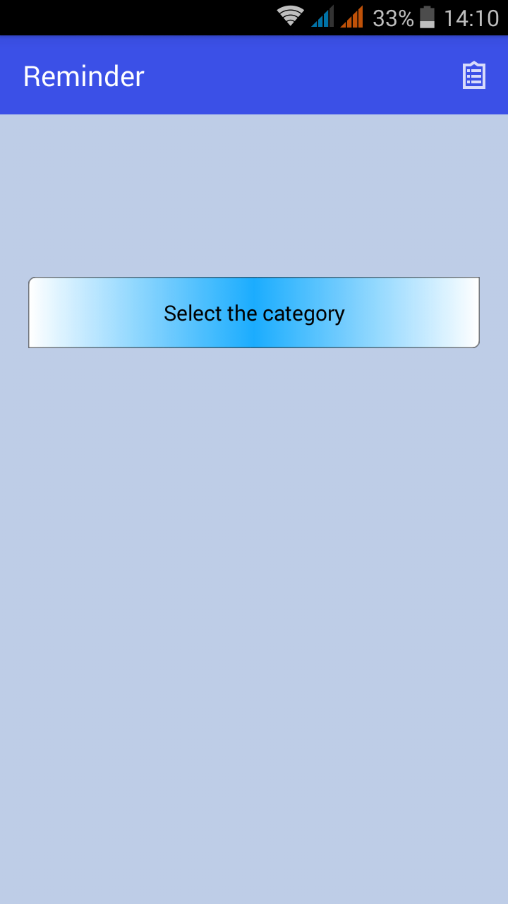
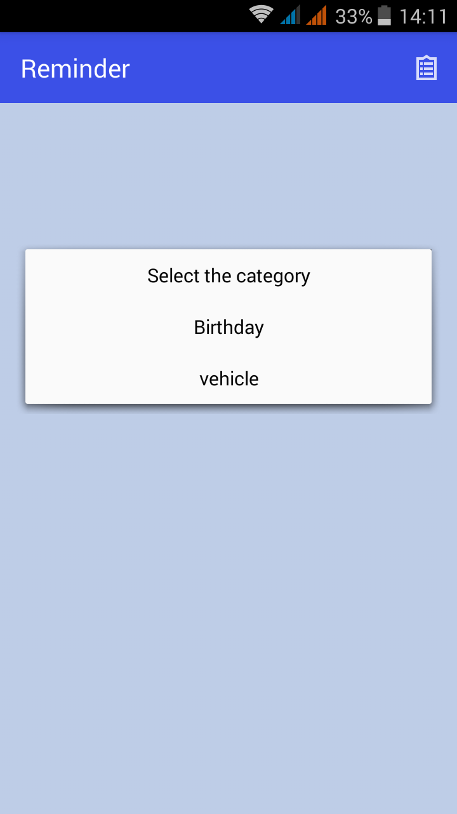
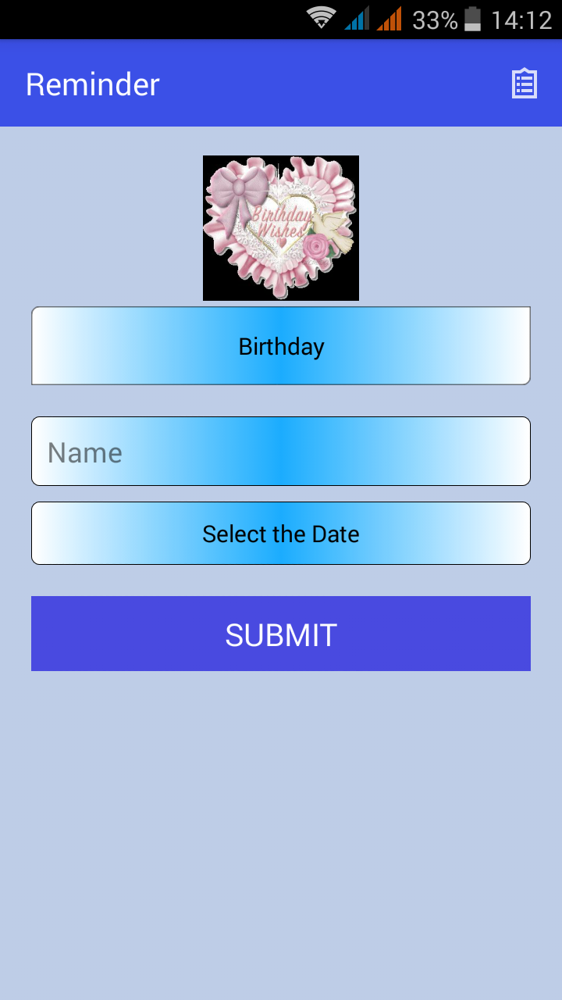
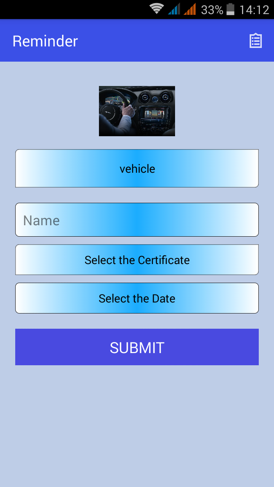
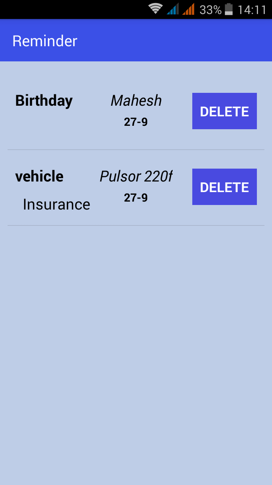
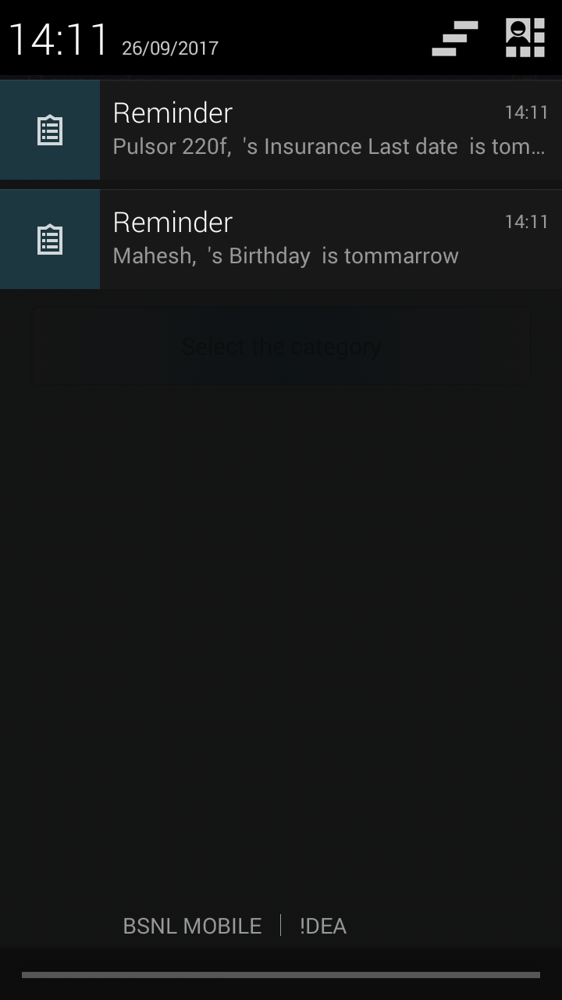

<h2><b><u>Reminding Spark</u></b></h2>

This is a Reminder app, which reminds the Birthday and Vehicle certificates ( Insurance, Tax and Pollution ) expiry date, one day before it expired. 
 

<h3><b><i>ScreenShots</i></b></h3>

........................

<table>
  <tr>
    <td>
      
      <h4><i>Splash Screen</i></h4>
    </td>
    <td>
      
      <h4><i>Home Screen</i></h4>
    </td>
    <td>
      
      <h4><i>Category Selection</i></h4>
    </td>
    <td>
      
      <h4><i>Birthday Screen</i></h4>
    </td>
  </tr>
  <tr>
    <td>
      
      <h4><i>Vehicle Screen</i></h4>
    </td>
    <td>
      
      <h4><i>View Details</i></h4>
    </td>
    <td>
      
      <h4><i>Notification</i></h4>
    </td>
  </tr>
</table>
